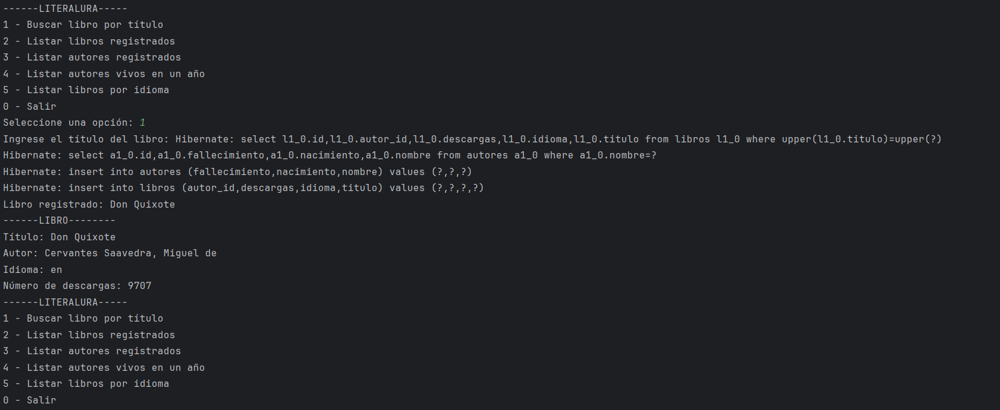
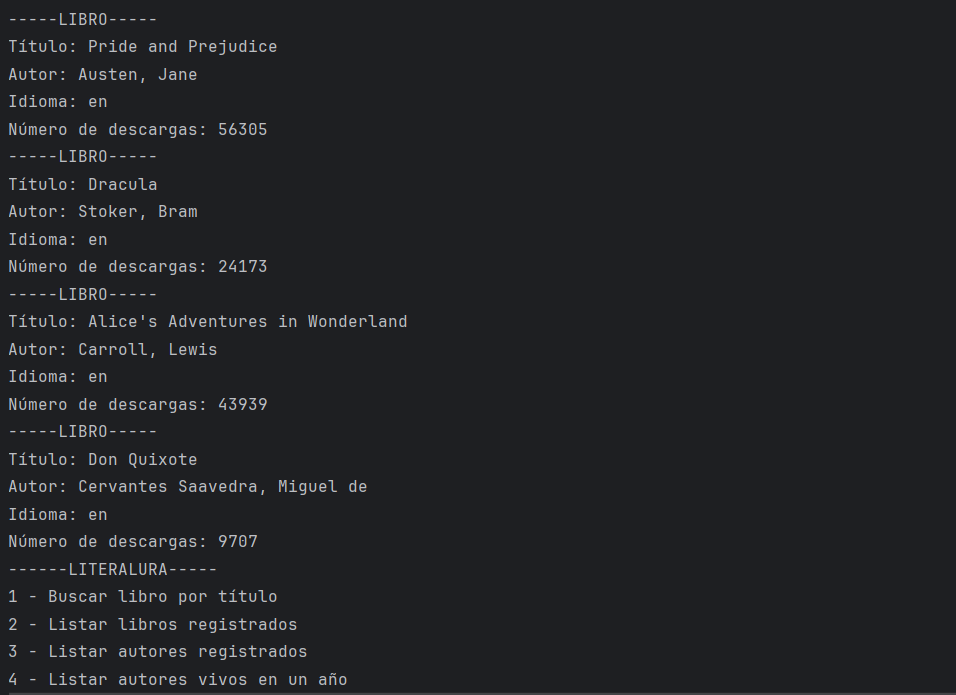
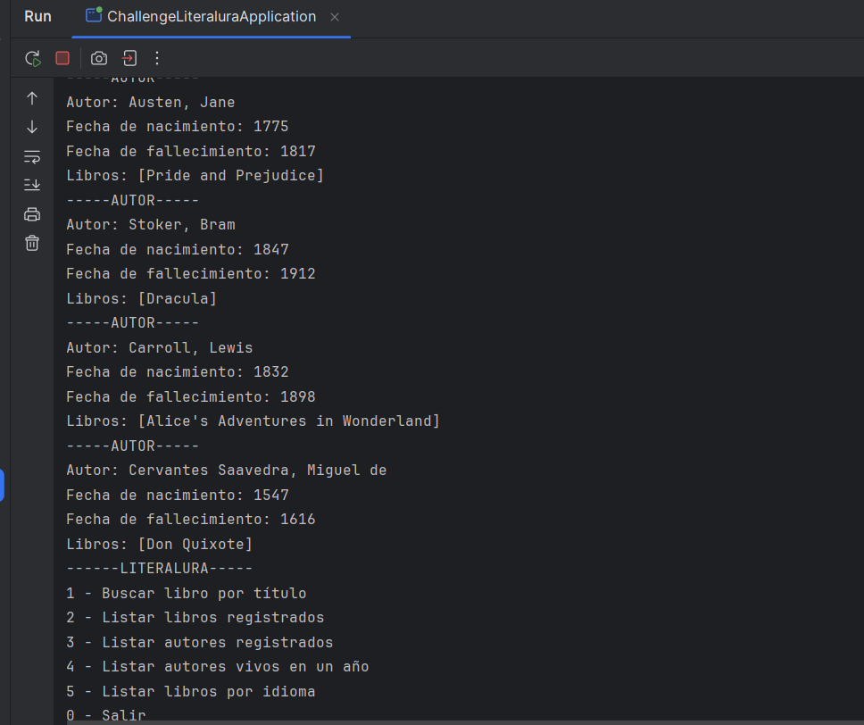
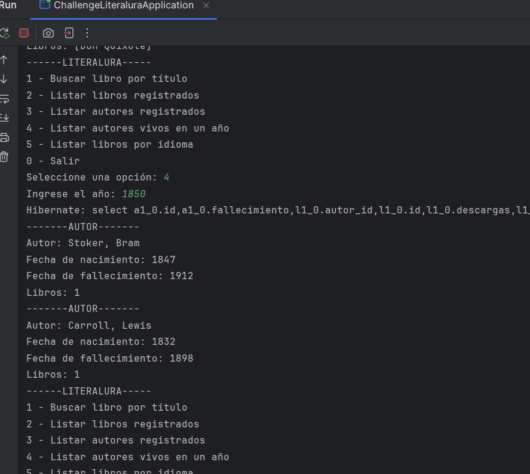
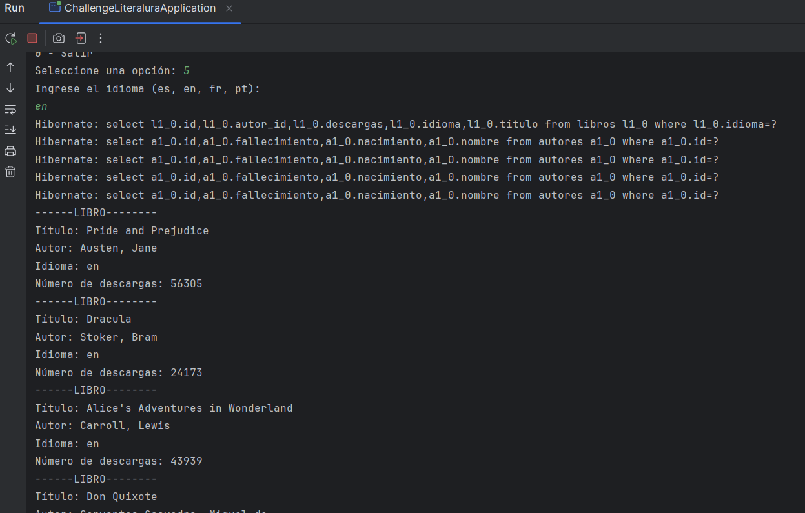

# **Challenge LiterAlura**

## **Descripción del Proyecto**
**LiterAlura** es una aplicación de consola que permite gestionar un catálogo de libros, utilizando la API de **Gutendex** para buscar y registrar libros, así como consultas avanzadas sobre autores y libros almacenados en una base de datos.

Este proyecto fue desarrollado como parte del programa Oracle Next Education en colaboración con Alura Latam, con las siguientes funcionalidades clave:
- Búsqueda de libros en la API por título.
- Registro de libros en una base de datos PostgreSQL.
- Listado de libros y autores registrados.
- Filtrado de autores vivos en un año específico.
- Filtrado de libros por idioma.

---

## **Características**

### **Menú Principal**
El sistema presenta un menú de opciones que permite al usuario interactuar con las distintas funcionalidades de la aplicación:

---

### **Buscar Libro por Título**
La opción **1** permite buscar un libro en la API de Gutendex mediante el título. Si el libro ya está registrado, se muestra un mensaje de advertencia. Si no está registrado, el libro se almacena en la base de datos.

**Ejemplo**:
- Entrada: `Don Quixote`
- Resultado:
  

---

### **Listar Libros Registrados**
La opción **2** muestra todos los libros registrados en la base de datos, con detalles como título, autor, idioma y número de descargas.

**Ejemplo**:

---

### **Listar Autores Registrados**
La opción **3** lista los autores almacenados, incluyendo sus fechas de nacimiento, fallecimiento y libros asociados.

**Ejemplo**:

---

### **Listar Autores Vivos en un Año**
La opción **4** filtra los autores que estaban vivos en un año específico. Esta funcionalidad permite consultas históricas más avanzadas.

**Ejemplo**:
- Entrada: `1850`
- Resultado:
  

---

### **Listar Libros por Idioma**
La opción **5** filtra libros registrados por idioma. Los idiomas soportados son:
- `es`: Español
- `en`: Inglés
- `fr`: Francés
- `pt`: Portugués

**Ejemplo**:
- Entrada: `en`
- Resultado:
  

---

## **Tecnologías Utilizadas**
- **Java 17**: Lenguaje principal del proyecto.
- **Spring Boot 3.2.4**: Framework utilizado para la configuración y ejecución del proyecto.
- **PostgreSQL**: Base de datos relacional para almacenar la información de libros y autores.
- **Gutendex API**: Fuente externa de datos para obtener información de libros.

---

